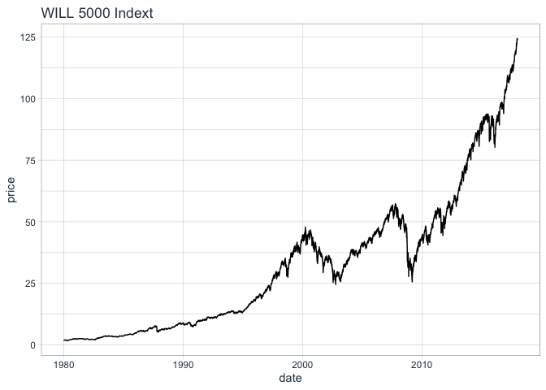
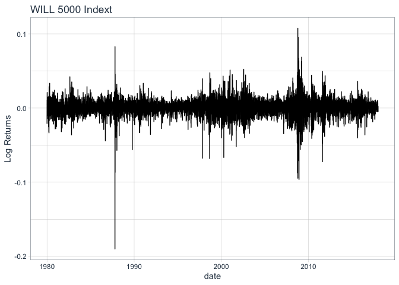
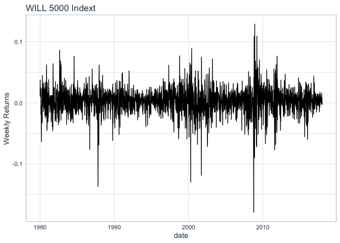
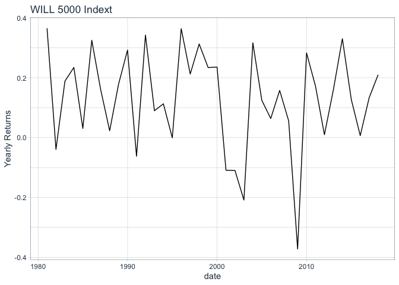
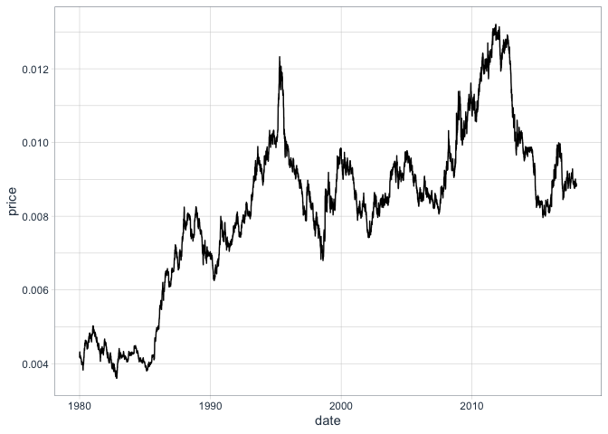

Risk Management with R - Module 1 - Data and Returns
================

The code from the course was adapted using the
[**tidyquant**](https://business-science.github.io/tidyquant/index.html)
package as a way to better understand its workflow and functions.

## Libraries

``` r
library(tidyverse)
library(quantmod)
library(tidyquant)
```

## 1\. Retrieving data fom FRED

``` r
#security = "GOLDPMGBD228NLBM"

security = "WILL5000IND"

wilsh <- tq_get(security, get = "economic.data", from = "1979-12-31", to  = "2017-12-31")

wilsh <- wilsh %>% 
  na.omit()

head(wilsh, 3)
```

    ## # A tibble: 3 x 3
    ##   symbol      date       price
    ##   <chr>       <date>     <dbl>
    ## 1 WILL5000IND 1979-12-31  1.9 
    ## 2 WILL5000IND 1980-01-02  1.86
    ## 3 WILL5000IND 1980-01-04  1.88

``` r
tail(wilsh, 3)
```

    ## # A tibble: 3 x 3
    ##   symbol      date       price
    ##   <chr>       <date>     <dbl>
    ## 1 WILL5000IND 2017-12-27  124.
    ## 2 WILL5000IND 2017-12-28  124.
    ## 3 WILL5000IND 2017-12-29  124.

``` r
wilsh %>% 
  ggplot(aes(x = date, y = price)) +
  geom_line() +
  labs(title = "WILL 5000 Indext") + 
  theme_tq()
```

<!-- -->

## 2\. Daily Returns

``` r
returns <- diff(log(wilsh$price))

returns <- append(returns, 0, 0)

wilsh <- wilsh %>% 
  mutate(logret = NA)

wilsh$logret = returns

#removing first row
wilsh <- wilsh[-1,]

wilsh %>% 
  ggplot(aes(x = date, y = logret)) +
  geom_line() +
  labs(title = "WILL 5000 Indext", y = "Log Returns") + 
  theme_tq()
```

<!-- -->

Or using the function:

``` r
log_returns <- wilsh %>%
    group_by(symbol) %>%
    tq_transmute(select = price, 
                 mutate_fun = periodReturn, 
                 period     = "daily", 
                 col_rename = "log_return")
```

## 3\. Longer Returns

### 3.1 Weekly returns

period\_return = exp(log\_ret\_1 + logret2\_ + ….. logret\_n) - 1

n: days in period

``` r
w_returns <- wilsh %>%
    group_by(symbol) %>%
    tq_transmute(select = price, 
                 mutate_fun = periodReturn, 
                 period     = "weekly", 
                 col_rename = "w_return")

w_returns %>% 
  ggplot(aes(x = date, y = w_return)) +
  geom_line() +
  labs(title = "WILL 5000 Indext", y = "Weekly Returns") + 
  theme_tq()
```

<!-- -->

### 3.2 Annual returns

``` r
y_returns <- wilsh %>%
    group_by(symbol) %>%
    tq_transmute(select = price, 
                 mutate_fun = periodReturn, 
                 period     = "yearly", 
                 col_rename = "y_return")

y_returns %>% 
  ggplot(aes(x = date, y = y_return)) +
  geom_line() +
  labs(title = "WILL 5000 Indext", y = "Yearly Returns") + 
  theme_tq()
```

<!-- -->

## 4\. Application 1

``` r
yen <- tq_get("DEXJPUS", get = "economic.data", from = "1979-12-31", to  = "2017-12-31")

yen <- yen %>% 
  na.omit()

yen$price <- 1/yen$price

yen %>% 
  ggplot(aes(x = date, y = price)) +
  geom_line() +
  theme_tq()
```

<!-- -->

``` r
d_returns <- yen %>%
    group_by(symbol) %>%
    tq_transmute(select = price, 
                 mutate_fun = periodReturn, 
                 period     = "daily", 
                 col_rename = "d_return")

m_returns <- yen %>%
    group_by(symbol) %>%
    tq_transmute(select = price, 
                 mutate_fun = periodReturn, 
                 period     = "monthly", 
                 col_rename = "m_return")

exp(m_returns$m_return[2]) - 1
```

    ## [1] 0.004061206

``` r
q_returns <- yen %>%
    group_by(symbol) %>%
    tq_transmute(select = price, 
                 mutate_fun = periodReturn, 
                 period     = "quarterly", 
                 col_rename = "q_return")

tail(q_returns,3)
```

    ## # A tibble: 3 x 3
    ## # Groups:   symbol [1]
    ##   symbol  date        q_return
    ##   <chr>   <date>         <dbl>
    ## 1 DEXJPUS 2017-06-30 -0.00881 
    ## 2 DEXJPUS 2017-09-29 -0.00213 
    ## 3 DEXJPUS 2017-12-29 -0.000444

``` r
y_returns <- yen %>%
    group_by(symbol) %>%
    tq_transmute(select = price, 
                 mutate_fun = periodReturn, 
                 period     = "yearly", 
                 col_rename = "y_return")


tail(y_returns,3)
```

    ## # A tibble: 3 x 3
    ## # Groups:   symbol [1]
    ##   symbol  date       y_return
    ##   <chr>   <date>        <dbl>
    ## 1 DEXJPUS 2015-12-31 -0.00349
    ## 2 DEXJPUS 2016-12-30  0.0299 
    ## 3 DEXJPUS 2017-12-29  0.0363

``` r
exp(y_returns$y_return[39]) - 1
```

    ## [1] 0.03696094
