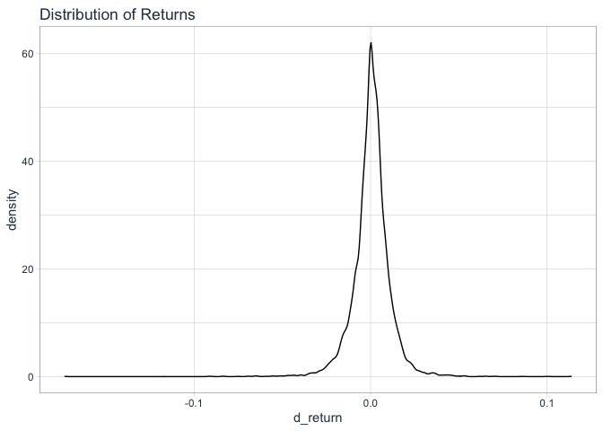

Risk Management with R - Module 2 - Normal Distributions
================

The code from the course was adapted using the
[**tidyquant**](https://business-science.github.io/tidyquant/index.html)
package as a way to better understand its workflow and functions.

## Libraries

``` r
library(tidyverse)
library(quantmod)
library(tidyquant)
library(skimr)
```

## 1\. Distribution of Returns

Loading Data

``` r
#security = "GOLDPMGBD228NLBM"

security = "WILL5000IND"

wilsh <- tq_get(security, get = "economic.data", from = "1979-12-31", to  = "2017-12-31")

wilsh <- wilsh %>% 
  na.omit()

log_returns <- wilsh %>%
    group_by(symbol) %>%
    tq_transmute(select = price, 
                 mutate_fun = periodReturn, 
                 period     = "daily", 
                 col_rename = "d_return")
```

Analyzing returns:

``` r
skim(log_returns)
```

|                                                  |              |
| :----------------------------------------------- | :----------- |
| Name                                             | log\_returns |
| Number of rows                                   | 9584         |
| Number of columns                                | 3            |
| \_\_\_\_\_\_\_\_\_\_\_\_\_\_\_\_\_\_\_\_\_\_\_   |              |
| Column type frequency:                           |              |
| Date                                             | 1            |
| numeric                                          | 1            |
| \_\_\_\_\_\_\_\_\_\_\_\_\_\_\_\_\_\_\_\_\_\_\_\_ |              |
| Group variables                                  | symbol       |

Data summary

**Variable type:
Date**

| skim\_variable | symbol      | n\_missing | complete\_rate | min        | max        | median     | n\_unique |
| :------------- | :---------- | ---------: | -------------: | :--------- | :--------- | :--------- | --------: |
| date           | WILL5000IND |          0 |              1 | 1979-12-31 | 2017-12-29 | 1998-12-14 |      9584 |

**Variable type:
numeric**

| skim\_variable | symbol      | n\_missing | complete\_rate | mean |   sd |     p0 | p25 | p50 |  p75 | p100 | hist  |
| :------------- | :---------- | ---------: | -------------: | ---: | ---: | -----: | --: | --: | ---: | ---: | :---- |
| d\_return      | WILL5000IND |          0 |              1 |    0 | 0.01 | \-0.17 |   0 |   0 | 0.01 | 0.11 | ▁▁▅▇▁ |

``` r
#mean
(mu = mean(log_returns$d_return))
```

    ## [1] 0.0004930988

``` r
#standard deviation
(sig = sd(log_returns$d_return))
```

    ## [1] 0.01067945

``` r
log_returns %>% 
  ggplot(aes(d_return)) +
  geom_density() +
  labs(title = "Distribution of Returns") + 
  theme_tq()
```

<!-- -->

## 2\. Value-at-Risk (VaR)

``` r
alpha = 0.05

#normal distribuition quantile
var = round(qnorm(alpha, mu, sig),6)
```

Applying to the hedge fund example:

  - Investor capital: $100 million
  - Bank: $900 million

<!-- end list -->

``` r
inv_cap = 100000
bank = 900000 

#var

(conf_level = (inv_cap + bank)*(exp(var)-1))
```

    ## [1] -16928.08

This means there’s a 5% chance that the hedge fund will lose more than
$`conf_level` millions a day.

## 3\. Expected Shortfall (ES)

a.k.a. cVaR, AVaR or expected tail loss

``` r
es = mu-sig*dnorm(qnorm(alpha,0,1),0,1)/alpha
```

the expected shortfall is `es*100`%.

Applying for the HF:

``` r
(es_hf = (inv_cap + bank)*(exp(es)-1))
```

    ## [1] -21305.3

**If** stocks fall more than `var*100`, the average loss will be
$`es_hf` million.

## 4\. Simulations to estimate VaR and ES

Mostly useful for non-normal distributions and checking values.

### 4.1. Normal distribution

Steps: - Draw 100.000 outcomes from N(mu, sig) - **VaR** is the *alpha*
quantile of the 100.000 outcomes - **ES** is the average of the worst
*alpha* x 100.000 outcomes

``` r
n_out <- 100000

set.seed(123789)

rvec <- rnorm(n_out, mu, sig)

(var_s <- quantile(rvec, alpha))
```

    ##          5% 
    ## -0.01716363

``` r
(es_s <- mean(rvec[rvec < var_s]))
```

    ## [1] -0.02174736

``` r
(es_hf_s = (inv_cap + bank)*(exp(es_s)-1))
```

    ## [1] -21512.59

As we can see, the results are very similiar to what was calculated
before.

### 4.2. Observed distribuition:

``` r
n_out <- 100000

set.seed(123789)

rvec <- sample(as.vector(log_returns$d_return), n_out, replace = TRUE)


(var_s_2 <- quantile(rvec, alpha))
```

    ##          5% 
    ## -0.01583263

``` r
(es_s_2 <- mean(rvec[rvec < var_s_2]))
```

    ## [1] -0.02492209

``` r
(es_hf_s_2 = (inv_cap + bank)*(exp(es_s_2)-1))
```

    ## [1] -24614.09

**If** stocks fall more than `var_s_2*100`, the average loss will be
$`es_hf_s_2` million.

The results are different, because the returns are **not** normally
distributed. Meaning that the VaR and ES calculated assuming the normal
distribution might be too small.
