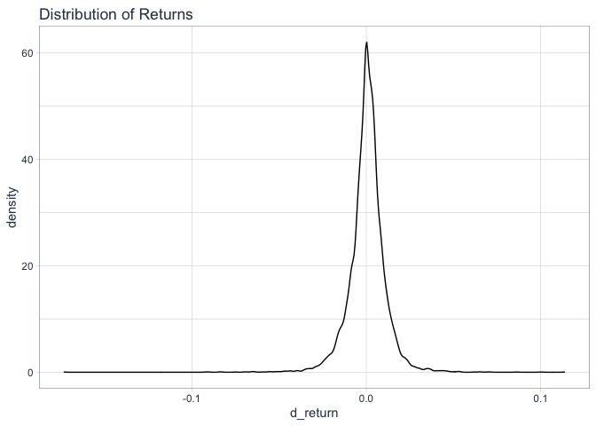
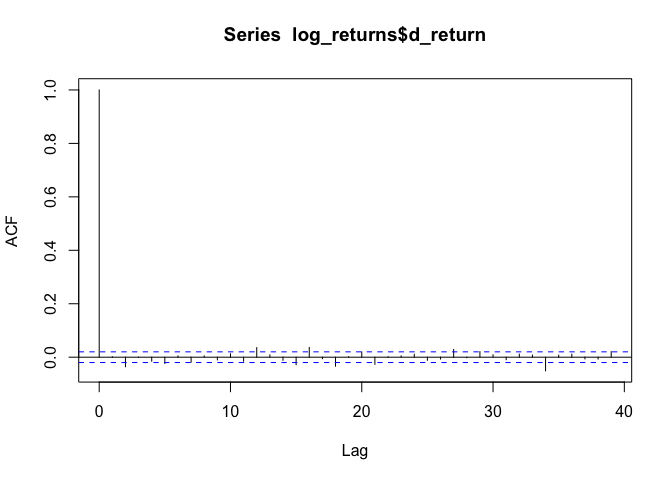
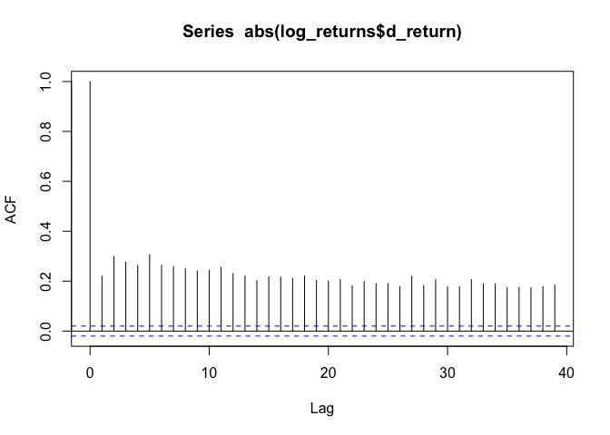
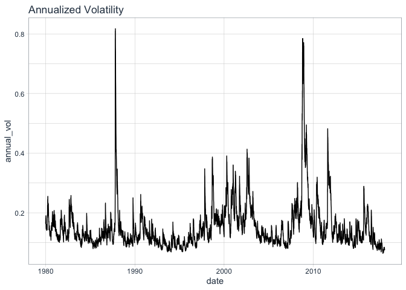
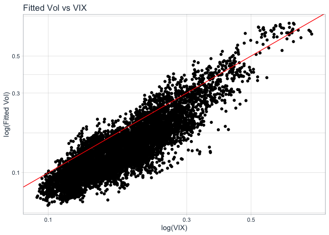

Risk Management with R - Module 4 - Volatility Clustering
================

The code from the course was adapted using the
[**tidyquant**](https://business-science.github.io/tidyquant/index.html)
package as a way to better understand its workflow and functions.

## Libraries

``` r
library(tidyverse)
library(quantmod)
library(tidyquant)
library(skimr)
library(rugarch)

#rmarkdown::render("Module 4.Rmd", envir=.GlobalEnv) #cria markdown com variáveis do global env
```

## 1\. Serial Correlation and Volatility Clustering

Loading Data

``` r
#security = "GOLDPMGBD228NLBM"

security = "WILL5000IND"

wilsh <- tq_get(security, get = "economic.data", from = "1979-12-31", to  = "2017-12-31")

wilsh <- wilsh %>% 
  na.omit()

log_returns <- wilsh %>%
    group_by(symbol) %>%
    tq_transmute(select = price, 
                 mutate_fun = periodReturn, 
                 period     = "daily", 
                 col_rename = "d_return")
```

Analyzing returns:

``` r
skim(log_returns)
```

|                                                  |              |
| :----------------------------------------------- | :----------- |
| Name                                             | log\_returns |
| Number of rows                                   | 9584         |
| Number of columns                                | 3            |
| \_\_\_\_\_\_\_\_\_\_\_\_\_\_\_\_\_\_\_\_\_\_\_   |              |
| Column type frequency:                           |              |
| Date                                             | 1            |
| numeric                                          | 1            |
| \_\_\_\_\_\_\_\_\_\_\_\_\_\_\_\_\_\_\_\_\_\_\_\_ |              |
| Group variables                                  | symbol       |

Data summary

**Variable type:
Date**

| skim\_variable | symbol      | n\_missing | complete\_rate | min        | max        | median     | n\_unique |
| :------------- | :---------- | ---------: | -------------: | :--------- | :--------- | :--------- | --------: |
| date           | WILL5000IND |          0 |              1 | 1979-12-31 | 2017-12-29 | 1998-12-14 |      9584 |

**Variable type:
numeric**

| skim\_variable | symbol      | n\_missing | complete\_rate | mean |   sd |     p0 | p25 | p50 |  p75 | p100 | hist  |
| :------------- | :---------- | ---------: | -------------: | ---: | ---: | -----: | --: | --: | ---: | ---: | :---- |
| d\_return      | WILL5000IND |          0 |              1 |    0 | 0.01 | \-0.17 |   0 |   0 | 0.01 | 0.11 | ▁▁▅▇▁ |

``` r
#mean
(mu = mean(log_returns$d_return))
```

    ## [1] 0.0004930988

``` r
#standard deviation
(sig = sd(log_returns$d_return))
```

    ## [1] 0.01067945

``` r
log_returns %>% 
  ggplot(aes(d_return)) +
  geom_density() +
  labs(title = "Distribution of Returns") + 
  theme_tq()
```

<!-- -->

### 1.1. Autocorrelation Coefficients Function

``` r
acf(log_returns$d_return)
```

<!-- -->

The more lines are outside the blue-dashed lines (95% confidence bands),
the more evidence of autocorrelation exisits. Since there aren’t many,
there is low evidence of autocorrelation.

### 1.2. Volatility Clustering

Check if the ordering of the data is important.

Testing:

``` r
acf(abs(log_returns$d_return))
```

<!-- -->

Since every autocorrelation coefficient is positive and outside the 95%
confidence interval, large returns tend to be followed by large returns,
and small returns tend to be followed by small returns. Thus confirming
the existence of voloatility clusters and importance of data ordering.

### 1.3 GARCH

``` r
?ugarchspec

rets <- log_returns$d_return

garch.N <- ugarchspec(variance.model = list(model = "sGARCH",garchOrder = c(1, 1)),
                                            mean.model = list(armaOrder = c(0, 0), include.mean = TRUE),
                                            distribution.model = "norm")

fit.garch.N <- ugarchfit(spec = garch.N, data = rets)
                                                              
save1 <- tibble(log_rets = rets, 
                sd = fit.garch.N@fit$sigma, 
                z = fit.garch.N@fit$z)
```

### 1.4 GARCH(1,1) - t

``` r
garch.t <- ugarchspec(variance.model = list(model = "sGARCH",garchOrder = c(1, 1)),
                                            mean.model = list(armaOrder = c(0, 0), include.mean = TRUE),
                                            distribution.model = "std")

fit.garch.t <- ugarchfit(spec = garch.t, data = rets)

#shaoe is the degree of freedom nu


save2 <- tibble(log_rets = rets, 
                sd = fit.garch.t@fit$sigma, 
                z = fit.garch.t@fit$z)

parm2 <- fit.garch.t@fit$coef
```

### 1.5 Diagnostics Test

``` r
save2 <- save2 %>%
  mutate(annual_vol = sd*sqrt(252)) %>%
  bind_cols(date = log_returns$date) 


save2 %>% 
  ggplot(aes(x = date, y = annual_vol)) +
  geom_line() +
  labs(title = "Annualized Volatility") + 
  theme_tq()
```

<!-- -->

  - Fitted Vol vs VIX

x = log(vix), y =
log(fitted\_vol)

``` r
vix <- tq_get("VIXCLS", get = "economic.data", from = "1979-12-31", to  = "2017-12-31")

vix <- vix %>% 
  na.omit()

tail(right_join(vix, save2, by = 'date'))
```

    ## # A tibble: 6 x 7
    ##   symbol date       price  log_rets      sd         z annual_vol
    ##   <chr>  <date>     <dbl>     <dbl>   <dbl>     <dbl>      <dbl>
    ## 1 VIXCLS 2017-12-21  9.62  0.00242  0.00519  0.312        0.0824
    ## 2 VIXCLS 2017-12-22  9.9  -0.000564 0.00508 -0.269        0.0807
    ## 3 VIXCLS 2017-12-26 10.2  -0.000726 0.00498 -0.307        0.0790
    ## 4 VIXCLS 2017-12-27 10.5   0.000807 0.00488  0.000569     0.0775
    ## 5 VIXCLS 2017-12-28 10.2   0.00234  0.00477  0.321        0.0757
    ## 6 VIXCLS 2017-12-29 11.0  -0.00531  0.00469 -1.30         0.0744

``` r
inner_join(vix, save2, by = 'date') %>% 
  ggplot(aes(x = price/100, y = annual_vol)) +
  geom_point() +
  scale_x_log10() +
  scale_y_log10() +
  geom_abline(intercept = 0, color = 'red') +
  labs(title = "Fitted Vol vs VIX", x = 'log(VIX)', y = 'log(Fitted Vol)') + 
  theme_tq()
```

<!-- -->

As we can see, the correlation between the GARCH predicted vol and the
VIX is strongly positive. On the other hand, it seems that VIX vols are
higher than GARCH predicted vols most of the time.

## 2\. VaR and ES

### 2.1. 1-day ahead simulation

``` r
set.seed(123789)

n_out = 100000

boot.garch <- ugarchboot(fit.garch.t,
                         method = "Partial",
                         sampling = "raw", #bootstrap from fitted epsolons
                         n.ahead = 1, #simulation horizon
                         n.bootpred = n_out, #number of simulations
                         solver = "solnp")


rvec <- boot.garch@fseries

alpha <- 0.05

(var <- quantile(rvec, alpha))
```

    ##           5% 
    ## -0.007429733

``` r
(es <- mean(rvec[rvec < var]))
```

    ## [1] -0.01074187

The GARCH model consider the volatility clusters, which wasn’t
considered in the methods used before.

### Rolling 1-day VaR simulation

``` r
train2016 <- log_returns %>% 
  filter(date <= "2016-12-31")

n2016 <- nrow(train2016)

roll.garch <- ugarchroll(spec = garch.t,
                         data = log_returns$d_return,
                         n.ahead = 1,
                         forecast.length = 1,
                         n.start = n2016,
                         refit.every = 1,
                         refit.window = "recursive",
                         calculate.VaR = TRUE,
                         VaR.alpha = c(0.02,0.05),
                         keep.coef = TRUE)
```
